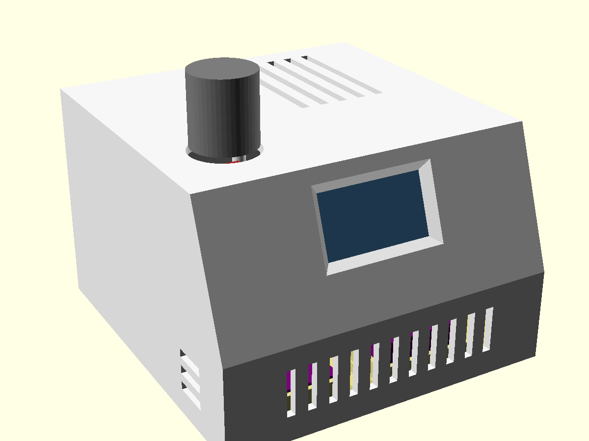
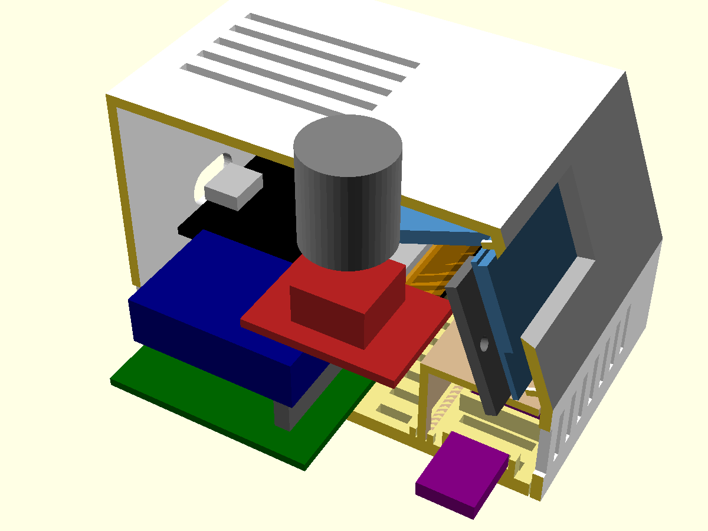

# Enclosure (ROADMAP task 15)

OpenSCAD model of the case, written from `MEASUREMENTS.md`. Open
`enclosure.scad` in OpenSCAD for the assembled view (modules shown as
coloured stand-in blocks). `-D cut=40` cuts the printed parts away left of
x = 40 to show the inside.

```
enclosure/export.sh   # clash check, then stl/*.stl (gitignored) + renders/*.png
```

The clash check fails if any printed part overlaps a module stand-in.

To look inside: **Window → Customizer**, untick `show_shell` (also
`show_base`, `show_hood`, `show_clamps`, `show_labels`), or set `cut`.
Stand-in colours: OLED steel blue, ESP32 black (antenna end orange),
carrier green, DS3231 navy, KY-040 red with a grey cap, sensors purple;
`show_labels` puts their names over them.

 

## Cardboard mock-up

```
enclosure/cardboard.py [cardboard mm, default 2]   # -> enclosure/cardboard.pdf (gitignored)
```

Two A4 pages of 1:1 templates, sized from the model: 2 sides, front strip,
screen panel (with the window), top (with the knob hole), back (with the
USB hole), and a floor with the modules' outlines drawn on it (not holes) to lay the real ones on. Print at 100%
("Actual size") and check the 50 mm bar with a ruler. Panels other than the
sides are narrower by 2 × the cardboard thickness, so they fit between the
sides. The mock-up checks size, screen angle, knob reach, and cables and
battery space; not the printed fits or the heat.

## Layout

80 x 84 x 54 mm (W x D x H). A wedge: the OLED sits on a panel tilted 20°
back, with a vented strip under it and the knob on top (left).

- **Sensor bay** (BME280, SCD41): low at the front, walled off by the `hood`
  (a roof and back wall). Air comes in through the floor slots and leaves
  through the front and side slots. Nothing warm is inside it. Sensor cables
  go out through a notch in the hood's back wall. The bay is ~16 mm tall
  inside, so **solder the sensor cables straight on, or use right-angle
  pins**: a vertical header with a Dupont plug on it doesn't fit.
- **ESP32**: sits on the carrier board at the back right, with USB-C out the
  back. Its antenna end hangs off the carrier's front edge (no copper under
  it) and has nothing above it. Top slots over it let its warm air out;
  intake slots are low on the back and in the floor.
- **Carrier board**: 60 x 40 mm cut from a Miuzei perfboard, on 4 standoffs
  (5 mm). Place it on the printed base, mark the standoff holes through, and
  drill them to 2 mm. The ESP32 and DS3231 plug into 8.5 mm female headers.
- **OLED**: glass flat against the panel's inner face, located by 4 corner
  stops, held by two printed clamp bars. Each bar is screwed to a post
  beside the board and presses on the PCB's side edge. The board's own
  corner holes aren't used: the glass reaches almost to them, so there's no
  room for a screw post. Pins face up. If the picture comes out upside down,
  flip the two orientation bytes in `display.c`, not the board.
- **Knob**: the KY-040 board sits flat under the top, pins to the back. Push
  it up into two snap hooks on its long edges and it rests against 4 pads.
  The cap goes on from outside afterwards.
- **Base**: the floor plate goes into the open bottom of the shell. It's held
  by 4 × M3 screws from below into the shell's corner bosses, so the case
  opens without touching the wiring. There's room left for a battery later.

## Parts to print

| STL | Qty | Orientation (as exported) | Notes |
|---|---|---|---|
| `shell` | 1 | upside down, top on the bed | no supports expected; check the USB hole's 13 mm bridge |
| `base` | 1 | flat | |
| `hood` | 1 | roof on the bed | |
| `clamp` | 2 (file has both) | flat | |
| `test_front` | 1 | like the shell | **print this first**: screen panel + top front with the knob mount |

Material: PETG preferred (PLA softens ~55 °C, e.g. in direct sun). Fit
clearance in the model is 0.3 mm (`clr`): ask the person printing it.

## Hardware

- 4 × M3 × 8 self-tapping (base → shell)
- 2 × M2 × 5 self-tapping (OLED clamp bars)
- 4 × M2 × 6 self-tapping (carrier board → standoffs)
- 4 self-adhesive rubber feet, ≥ 2 mm tall (they lift the floor slots off the desk)
- JST-XH connectors and cables, see ROADMAP task 15

## Assumed, not measured

Marked `ASSUMED` in `enclosure.scad`; the test print shows whether they're
right: the OLED lit area's
position (±0.5 from a photo), the EC11 body size, the ESP32/KY-040 PCB
thickness (1.6), and the female header height (8.5).

## Test print checklist (`test_front`)

1. OLED: the glass sits flat between the 4 stops, and the lit area is
   centred in the window with no dark edge.
2. The clamp bars screw down without bending the board.
3. KY-040: it snaps in, the shaft is centred in the 16 mm hole, and the cap
   turns and presses without rubbing the top.
